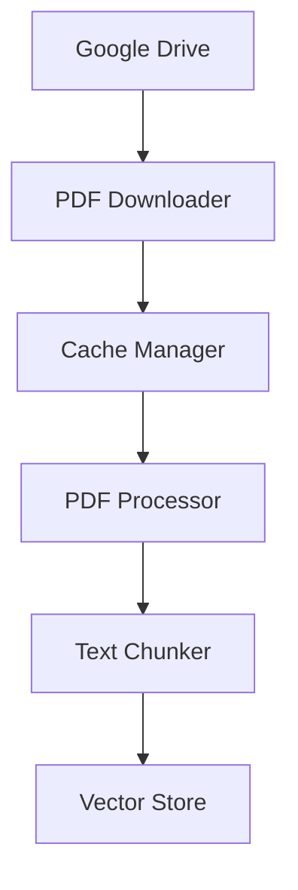
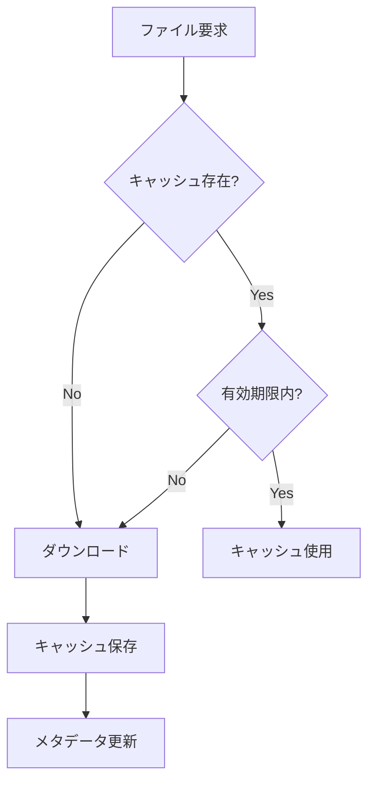
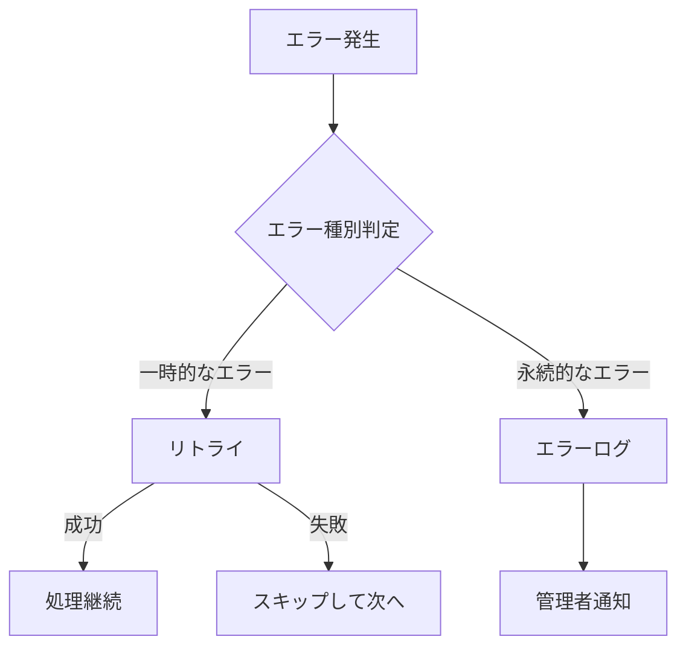

# Phase 2: データ処理システム設計

## 概要

Google DriveからPDFファイルを取得し、テキスト抽出とチャンク分割を行うシステムの設計について説明します。

## システムコンポーネント



## 1. Google Drive連携

### 認証フロー
1. 初回実行時：
   - OAuth 2.0認証画面表示
   - アクセストークン取得
   - トークンのローカル保存
2. 2回目以降：
   - 保存されたトークンを使用
   - 必要に応じて自動更新

### ファイル管理
- 指定されたフォルダ内のPDFファイルを監視
- 変更検知による自動更新
- メタデータの保持（ファイル名、更新日時等）

## 2. キャッシュシステム

### キャッシュ戦略


### キャッシュ管理
- 保存場所：`cache/pdf/`
- マニフェストファイル：`cache/pdf/manifest.json`
- キャッシュ有効期間：24時間（設定可能）
- 自動クリーンアップ機能

## 3. PDFテキスト処理

### テキスト抽出
- PyPDF2を使用
- ページごとの抽出
- メタデータの保持
- エラーハンドリング

### テキスト前処理
1. 不要な文字の除去
   - 制御文字
   - 余分な空白
   - 特殊文字
2. 正規化
   - 全角→半角変換
   - 改行の統一
   - 文字エンコーディングの確認

### チャンク分割アルゴリズム
```python
チャンクサイズ = 500トークン
オーバーラップ = 50トークン

1. テキストを段落に分割
2. 各段落のトークン数を計算
3. チャンクサイズを超えない範囲で段落を結合
4. オーバーラップを考慮して次のチャンクを開始
```

## 4. データ保存形式

### チャンクデータ
```json
{
  "text": "チャンクのテキスト内容",
  "metadata": {
    "file_name": "example.pdf",
    "page_number": 1,
    "chunk_index": 0,
    "chunk_size": 450,
    "creation_date": "2025-05-15T00:00:00Z"
  }
}
```

### ベクトルストア
- 保存場所：`cache/vector_store/`
- ファイル構造：
  ```
  vector_store/
  ├── metadata.json
  ├── document_id_1/
  │   ├── chunks.json
  │   └── embeddings.json
  └── document_id_2/
      ├── chunks.json
      └── embeddings.json
  ```

## 5. エラーハンドリング

### 想定されるエラー
1. Google Drive関連
   - 認証エラー
   - ネットワークエラー
   - ファイルアクセスエラー
2. PDF処理関連
   - 破損ファイル
   - パースエラー
   - メモリ不足
3. ストレージ関連
   - ディスク容量不足
   - 書き込み権限エラー

### エラー復旧戦略


## 6. モニタリング

### 監視項目
- 処理済みファイル数
- エラー率
- 処理時間
- キャッシュヒット率
- ストレージ使用量

### ログ形式
```
YYYY-MM-DD HH:MM:SS [LEVEL] message
{
  "event": "pdf_processing",
  "file": "example.pdf",
  "status": "success",
  "metrics": {
    "pages": 10,
    "chunks": 25,
    "processing_time": 1.5
  }
}
```

## 7. 設定パラメータ

### 環境変数
```env
GOOGLE_DRIVE_FOLDER_ID=your_folder_id
CACHE_TTL_HOURS=24
CHUNK_SIZE=500
CHUNK_OVERLAP=50
MAX_RETRIES=3
BATCH_SIZE=5
```

## 8. デプロイメントフロー

1. 依存関係のインストール確認
2. 環境変数の設定
3. Google Drive APIの認証設定
4. キャッシュディレクトリの作成
5. 初期設定の実行
6. テスト実行

## 9. テスト戦略

### テストケース
1. 単体テスト
   - PDF処理関数
   - チャンク分割ロジック
   - キャッシュ管理

2. 統合テスト
   - Google Drive連携
   - エンドツーエンドの処理フロー

3. パフォーマンステスト
   - 大規模PDFの処理
   - 並行処理の効率

## 実装スケジュール

1. Day 1: Google Drive連携
2. Day 2: PDFテキスト処理
3. Day 3: キャッシュシステム
4. Day 4: テストとデバッグ

## 注意点
- メモリ使用量の監視
- 大規模ファイルへの対応
- エラーからの復旧手順
- バックアップ戦略