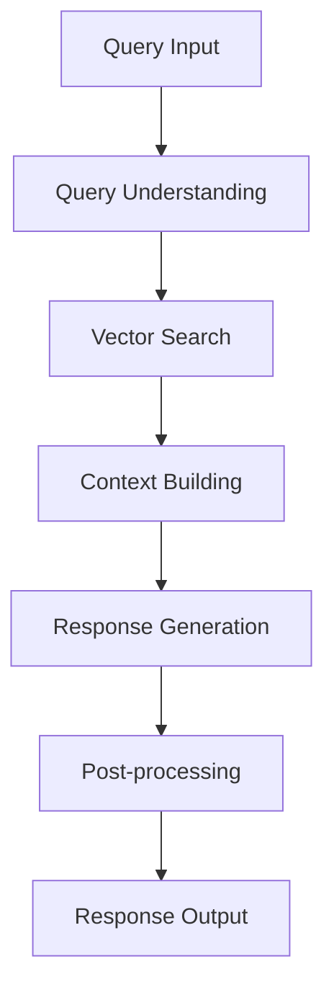
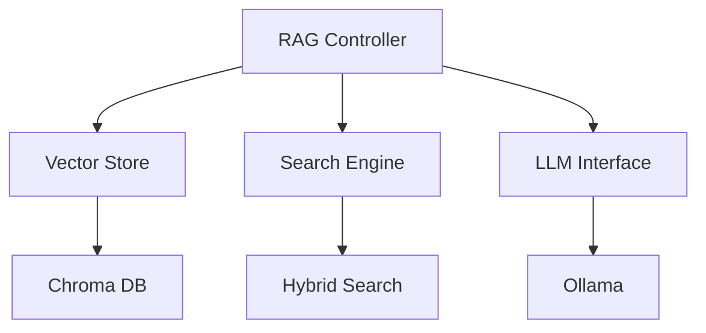
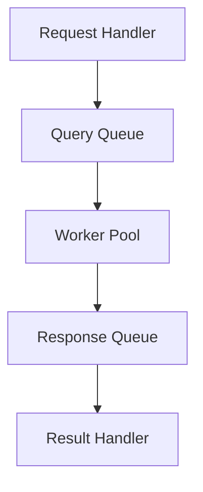

# Phase 2 評価と Phase 3 準備

## Phase 2の実装評価

### 実装完了機能
1. データ取得基盤
   - Google Drive連携
   - PDF処理
   - キャッシュ管理
   - 変更監視

2. エラー処理
   - 構造化されたエラー階層
   - リトライメカニズム
   - エラーログ

3. 進捗管理
   - リアルタイム進捗表示
   - コールバックベースの通知
   - 非同期処理

### 技術的評価

#### 👍 良好な点
1. モジュール性
   - 明確な責務分離
   - 疎結合な設計
   - テスト容易性

2. エラー耐性
   - 包括的なエラーハンドリング
   - 自動リカバリー機能
   - デバッグ容易性

3. 拡張性
   - プラグイン可能な設計
   - 設定の柔軟性
   - APIの一貫性

#### 🔧 改善が必要な点
1. パフォーマンス
   - 大量ファイル処理時のメモリ使用
   - バッチ処理の最適化
   - 並列処理の検討

2. 監視機能
   - より細かな状態管理
   - メトリクス収集
   - 異常検知

3. データ整合性
   - トランザクション的な処理
   - 整合性チェック
   - バックアップ戦略

## Phase 3への移行準備

### RAG実装に向けた要件

1. ベクトルストア要件
   - スケーラビリティ
   - 検索性能
   - データ永続化
   ```python
   # 想定されるインターフェース
   class VectorStore:
       async def add_embeddings(self, embeddings, metadata)
       async def search(self, query_vector, top_k=5)
       async def delete(self, filter_criteria)
   ```

2. 検索機能要件
   - セマンティック検索
   - ハイブリッド検索（キーワード + セマンティック）
   - フィルタリング
   ```python
   # 検索クエリの例
   query = {
       "text": "検索テキスト",
       "filters": {
           "document_type": "pdf",
           "date_range": ["2025-01-01", "2025-12-31"]
       },
       "hybrid_weight": 0.7  # セマンティック vs キーワード
   }
   ```

3. 生成機能要件
   - コンテキスト管理
   - プロンプト最適化
   - 応答品質制御
   ```python
   # 生成パイプラインの例
   async def generate_response(query, context):
       relevant_chunks = await vector_store.search(query)
       enhanced_prompt = prompt_builder.build(query, relevant_chunks)
       response = await llm.generate(enhanced_prompt)
       return Response(
           text=response,
           sources=relevant_chunks,
           confidence=calculate_confidence(response)
       )
   ```

### アーキテクチャ設計方針

1. データフロー


2. コンポーネント構成


3. 非同期処理


### 実装計画

1. 準備フェーズ（1-2日）
   - ベクトルストアの選定と検証
   - 非同期処理フレームワークの設定
   - テスト環境の整備

2. コア実装（3-4日）
   - ベクトル検索の実装
   - 生成パイプラインの構築
   - コンテキスト管理の実装

3. 最適化（2-3日）
   - パフォーマンスチューニング
   - プロンプト最適化
   - キャッシュ戦略の実装

4. 統合テスト（1-2日）
   - エンドツーエンドテスト
   - 負荷テスト
   - エラー処理の検証

### 注意点

1. パフォーマンス
   - メモリ使用量の監視
   - レイテンシの最適化
   - スケーラビリティの確保

2. 品質管理
   - 応答の一貫性
   - ソース追跡可能性
   - 信頼性指標の実装

3. 運用考慮
   - モニタリング体制
   - デバッグ容易性
   - メンテナンス性

## 次のステップ

1. Phase 2からの移行作業
   - 既存データの検証
   - インターフェースの確認
   - 依存関係の整理

2. Phase 3の環境準備
   - 必要なライブラリの追加
   - 設定ファイルの更新
   - テスト環境の構築

3. 実装開始
   - ベクトルストアの実装から着手
   - 段階的な機能追加
   - 継続的な品質確認