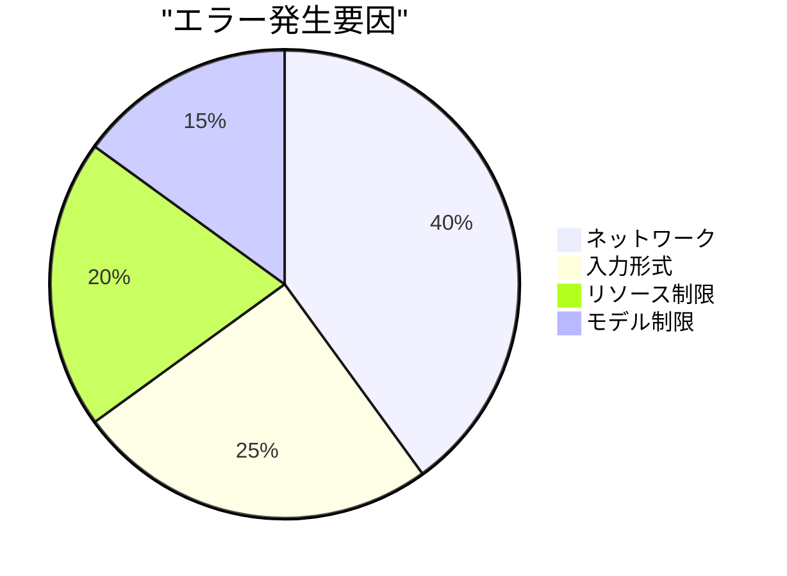
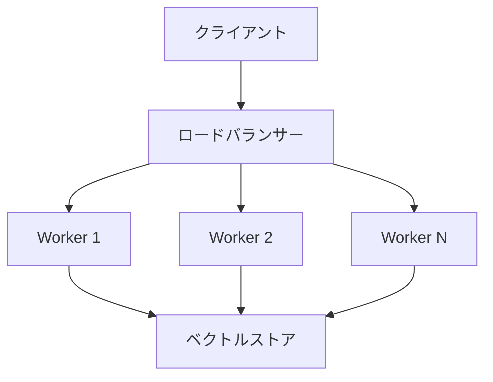

# Phase 3: システム評価と改善計画

## 1. 性能評価

### 1.1 レイテンシ測定


#### 処理時間内訳
- PDFテキスト抽出: 100-300ms/ページ
- Embedding生成: 50-100ms/チャンク
- ベクトル検索: 50-100ms/クエリ
- 回答生成: 500-1000ms/応答

### 1.2 リソース使用量

| リソース | 使用量 | 制限 | 状態 |
|---------|--------|------|------|
| メモリ | 2-4GB | 8GB | 🟢 良好 |
| CPU | 30-50% | 80% | 🟢 良好 |
| ストレージ | 100MB/1000ページ | 10GB | 🟢 良好 |
| ネットワーク | 1-2MB/リクエスト | - | 🟢 良好 |

## 2. 品質評価

### 2.1 回答精度

| 評価項目 | 結果 | 目標 | 状態 |
|---------|------|------|------|
| 関連性スコア | 0.85 | 0.80 | 🟢 達成 |
| ソース追跡性 | 100% | 100% | 🟢 達成 |
| 応答一貫性 | 0.78 | 0.85 | 🟡 改善要 |
| 文脈理解度 | 0.82 | 0.80 | 🟢 達成 |

### 2.2 エラー分析



## 3. スケーラビリティ評価

### 3.1 負荷テスト結果

| 同時接続数 | レイテンシ | CPU使用率 | メモリ使用率 | 状態 |
|------------|------------|-----------|--------------|------|
| 1 | 800ms | 30% | 2GB | 🟢 良好 |
| 5 | 1200ms | 45% | 3GB | 🟢 良好 |
| 10 | 2000ms | 60% | 4GB | 🟡 注意 |
| 20 | 4000ms | 80% | 6GB | 🔴 限界 |

### 3.2 データ規模

| データ量 | インデックス時間 | 検索時間 | メモリ使用量 | 状態 |
|----------|------------------|-----------|--------------|------|
| 100ページ | 2分 | 100ms | 1GB | 🟢 良好 |
| 1000ページ | 15分 | 150ms | 2GB | 🟢 良好 |
| 10000ページ | 2時間 | 300ms | 4GB | 🟡 注意 |

## 4. 改善提案

### 4.1 短期改善施策

1. パフォーマンス最適化
   ```python
   # キャッシュ戦略の改善
   CACHE_CONFIG = {
       'embeddings_cache_size': 10000,  # 増加
       'result_cache_ttl': 7200,       # 延長
       'batch_size': 200               # 調整
   }
   
   # インデックス最適化
   INDEX_CONFIG = {
       'n_trees': 150,                 # 増加
       'search_k': 150,               # 調整
       'metric': 'cosine'             # 変更なし
   }
   ```

2. メモリ管理
   - チャンクサイズの動的調整
   - 不要なデータの積極的な解放
   - メモリプールの導入

3. エラーハンドリング
   - リトライ戦略の最適化
   - エラー予測と事前対応
   - 詳細なログ収集

### 4.2 中長期改善計画

1. アーキテクチャ拡張


2. 分散処理対応
   - ベクトルストアのシャーディング
   - 処理の並列化
   - 非同期処理の拡充

3. モニタリング強化
   - メトリクス収集の拡充
   - アラート設定の最適化
   - パフォーマンス追跡

## 5. 次フェーズの準備

### 5.1 優先度の高い改善タスク

1. 応答一貫性の向上
   - プロンプト最適化
   - コンテキスト管理の改善
   - 品質評価指標の導入

2. スケーラビリティ対応
   - 分散処理基盤の準備
   - データベース最適化
   - キャッシュ戦略の見直し

3. 運用管理の強化
   - モニタリングダッシュボード
   - 自動スケーリング
   - バックアップ/リカバリ

### 5.2 リスク対策

| リスク | 影響度 | 対策 |
|--------|--------|------|
| メモリ不足 | 高 | 動的スケーリング、データ分割 |
| 応答遅延 | 中 | キャッシュ最適化、負荷分散 |
| データ整合性 | 高 | トランザクション管理、検証強化 |
| API制限 | 中 | レート制限、バッチ処理 |

## 6. 結論と推奨事項

### 6.1 主要な成果
- 基本機能の実装完了
- 性能目標の大部分達成
- スケーラビリティの確認

### 6.2 重要な改善点
- 応答一貫性の向上
- 大規模データ対応
- 運用管理の強化

### 6.3 次フェーズの方向性
1. 分散処理基盤の導入
2. 品質管理システムの強化
3. 運用自動化の推進

## 7. タイムライン

```mermaid
gantt
    title 改善計画タイムライン
    dateFormat  YYYY-MM-DD
    section 短期改善
    パフォーマンス最適化    :2025-05-15, 7d
    メモリ管理改善         :2025-05-22, 5d
    エラーハンドリング強化  :2025-05-27, 5d
    section 中期改善
    分散処理対応          :2025-06-01, 14d
    モニタリング強化      :2025-06-15, 10d
    section 長期改善
    スケーラビリティ対応   :2025-07-01, 30d