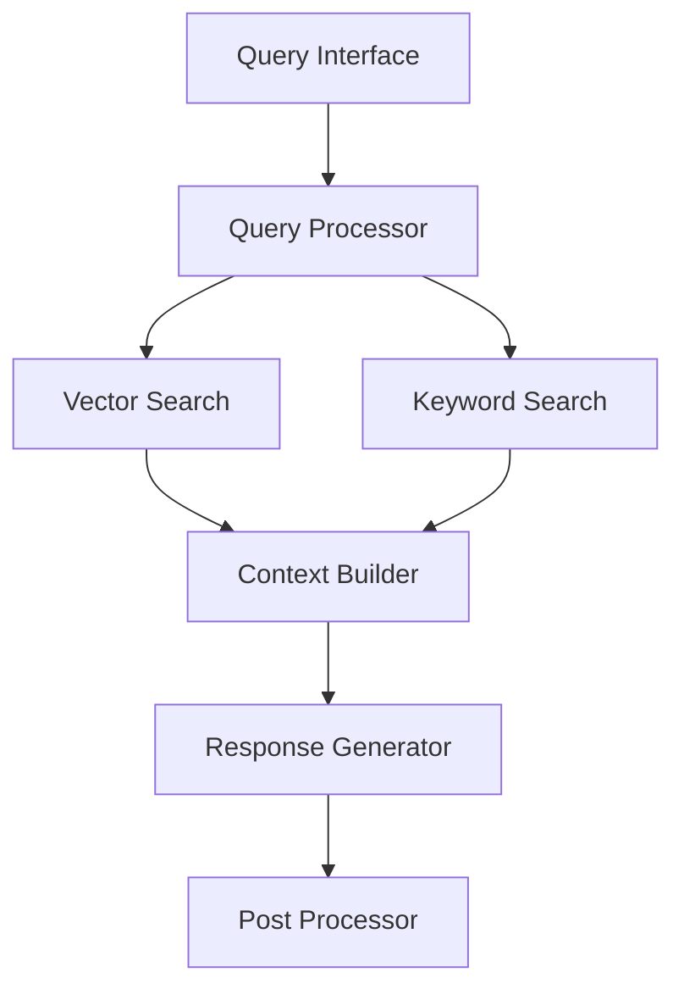

# Phase 3: RAGシステム実装計画

## 1. システム概要

### 目的
- 効率的な文書検索と回答生成
- 高精度なコンテキスト管理
- スケーラブルな検索基盤の構築

### アーキテクチャ


## 2. コアコンポーネント

### 2.1 ベクトルストア (VectorStore)
```python
class VectorStore:
    """ベクトルデータの永続化と検索を管理"""
    
    async def add_embeddings(
        self,
        embeddings: List[List[float]],
        texts: List[str],
        metadata: List[Dict]
    ) -> None:
        """ベクトルデータを追加"""
        
    async def search(
        self,
        query_vector: List[float],
        top_k: int = 5,
        filter_criteria: Optional[Dict] = None
    ) -> List[SearchResult]:
        """類似ベクトルを検索"""
        
    async def delete(
        self,
        filter_criteria: Dict
    ) -> None:
        """条件に合うデータを削除"""
```

### 2.2 検索エンジン (SearchEngine)
```python
class SearchEngine:
    """ハイブリッド検索を実装"""
    
    async def search(
        self,
        query: str,
        semantic_weight: float = 0.7,
        filters: Optional[Dict] = None
    ) -> List[SearchResult]:
        """セマンティック検索とキーワード検索を組み合わせ"""
        
    async def rerank(
        self,
        results: List[SearchResult],
        query: str
    ) -> List[SearchResult]:
        """検索結果を再ランク付け"""
```

### 2.3 コンテキストビルダー (ContextBuilder)
```python
class ContextBuilder:
    """回答生成用のコンテキストを構築"""
    
    def build_context(
        self,
        query: str,
        search_results: List[SearchResult],
        max_tokens: int
    ) -> Context:
        """コンテキストを構築"""
        
    def optimize_chunks(
        self,
        chunks: List[str],
        max_tokens: int
    ) -> List[str]:
        """チャンクを最適化"""
```

### 2.4 応答生成器 (ResponseGenerator)
```python
class ResponseGenerator:
    """LLMを使用して回答を生成"""
    
    async def generate(
        self,
        query: str,
        context: Context,
        model_name: str = "mistral-7b"
    ) -> Response:
        """回答を生成"""
        
    def validate_response(
        self,
        response: str,
        context: Context
    ) -> bool:
        """応答の妥当性を検証"""
```

## 3. 実装フェーズ

### Phase 3.1: ベクトルストア実装 (2日)
1. ChromaDBの統合
   - インデックス最適化
   - バッチ処理対応
   - エラーハンドリング

2. 検索機能の実装
   - 類似度計算の最適化
   - フィルタリング機能
   - キャッシュ戦略

### Phase 3.2: 検索エンジン実装 (2日)
1. ハイブリッド検索
   - セマンティック検索
   - キーワード検索
   - スコア結合ロジック

2. 再ランキング
   - コンテキスト考慮
   - メタデータ活用
   - スコア調整

### Phase 3.3: コンテキスト管理実装 (2日)
1. コンテキストビルダー
   - チャンク選択ロジック
   - トークン制限対応
   - メタデータ管理

2. 最適化機能
   - 重複排除
   - 関連性スコアリング
   - コンテキスト圧縮

### Phase 3.4: 生成システム実装 (2日)
1. 応答生成
   - プロンプト最適化
   - モデル選択ロジック
   - パラメータ調整

2. 品質管理
   - 応答検証
   - ソース追跡
   - 信頼性スコアリング

## 4. 最適化戦略

### 4.1 パフォーマンス最適化
```python
# キャッシュ設定
CACHE_CONFIG = {
    'vector_cache_size': 1000,  # ベクトルキャッシュサイズ
    'result_cache_ttl': 3600,   # 結果キャッシュTTL（秒）
    'batch_size': 100           # バッチ処理サイズ
}

# インデックス設定
INDEX_CONFIG = {
    'n_trees': 100,             # Annoyツリー数
    'search_k': 100,            # 検索パラメータ
    'metric': 'angular'         # 類似度メトリック
}
```

### 4.2 スケーラビリティ対策
1. バッチ処理
   - ベクトル計算
   - インデックス更新
   - 検索処理

2. 非同期処理
   - I/O処理
   - モデル推論
   - キャッシュ更新

### 4.3 品質管理
1. メトリクス収集
   - レイテンシ
   - ヒット率
   - 応答品質

2. モニタリング
   - リソース使用状況
   - エラー率
   - パフォーマンス指標

## 5. テスト戦略

### 5.1 単体テスト
- ベクトル計算
- 検索ロジック
- コンテキスト生成

### 5.2 統合テスト
- エンドツーエンドフロー
- エラー処理
- パフォーマンス

### 5.3 負荷テスト
- 大規模データセット
- 並行リクエスト
- リソース使用率

## 6. 成功基準

1. パフォーマンス
   - 検索レイテンシ < 100ms
   - 生成レイテンシ < 1s
   - メモリ使用量 < 4GB

2. 品質
   - 検索精度 > 90%
   - 応答関連性 > 85%
   - エラー率 < 1%

3. スケーラビリティ
   - 10万文書対応
   - 100同時接続対応
   - 安定動作24時間