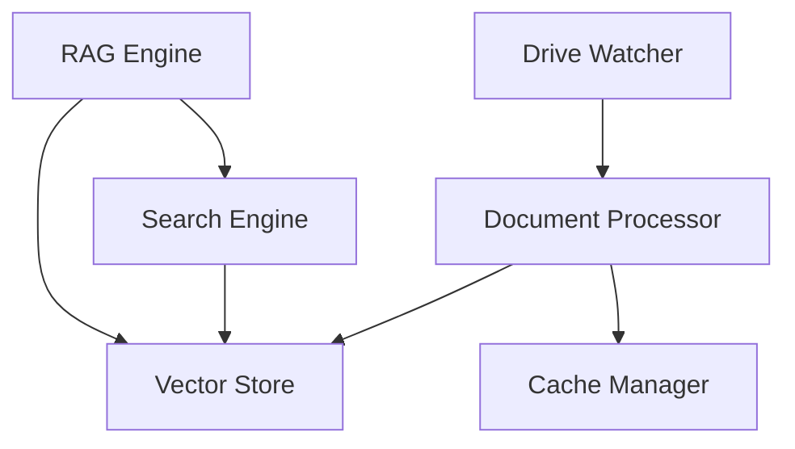
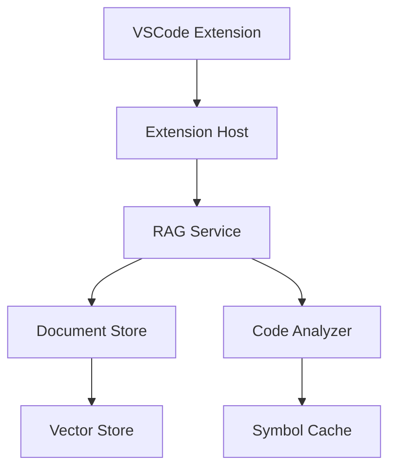
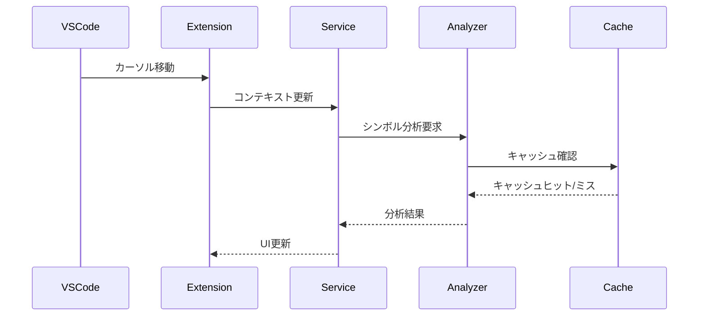
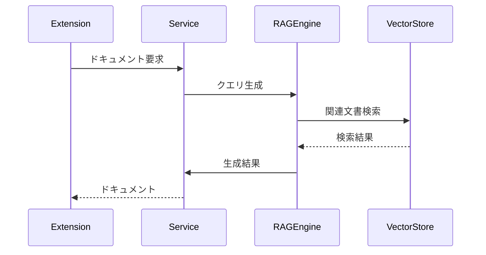

# Phase 4: RooCode連携設計

## 1. 現状アーキテクチャ



## 2. RooCode連携要件

### 2.1 機能要件

1. VSCode拡張機能との連携
   - コンテキスト共有
   - リアルタイム応答
   - インクリメンタル検索

2. コード理解支援
   - シンボル解決
   - 依存関係分析
   - コードスニペット生成

3. ドキュメント連携
   - インライン文書参照
   - API仕様書連携
   - コメント生成

### 2.2 非機能要件

| 要件 | 目標値 | 備考 |
|------|--------|------|
| 応答時間 | <500ms | エディタ体験の維持 |
| メモリ使用量 | <2GB | VSCode環境考慮 |
| CPU使用率 | <30% | バックグラウンド処理 |
| 起動時間 | <3秒 | 初期化処理の最適化 |

## 3. システム拡張設計

### 3.1 アーキテクチャ変更



### 3.2 新規コンポーネント

1. コード分析エンジン
```python
class CodeAnalyzer:
    """コード分析エンジン"""
    
    async def analyze_symbol(self, symbol: str, context: Dict) -> SymbolInfo:
        """シンボル情報の分析"""
        
    async def analyze_dependencies(self, file_path: str) -> DependencyGraph:
        """依存関係の分析"""
        
    async def generate_documentation(self, code: str) -> str:
        """ドキュメント生成"""
```

2. 拡張機能インターフェース
```typescript
interface RooCodeService {
  // コンテキスト管理
  updateContext(context: EditorContext): Promise<void>;
  
  // シンボル解決
  resolveSymbol(symbol: string): Promise<SymbolInfo>;
  
  // ドキュメント生成
  generateDocs(code: string): Promise<string>;
  
  // スニペット生成
  generateSnippet(description: string): Promise<CodeSnippet>;
}
```

3. キャッシュ管理
```python
class SymbolCache:
    """シンボル情報のキャッシュ"""
    
    async def get(self, key: str) -> Optional[SymbolInfo]:
        """キャッシュからシンボル情報を取得"""
        
    async def update(self, key: str, info: SymbolInfo) -> None:
        """シンボル情報を更新"""
```

### 3.3 データフロー

1. エディタイベント処理


2. ドキュメント生成


## 4. 実装計画

### 4.1 フェーズ分割

1. 基盤構築（2週間）
   - VSCode拡張の基本構造
   - サービス間通信
   - キャッシュ基盤

2. コア機能実装（3週間）
   - シンボル分析
   - 依存関係分析
   - ドキュメント生成

3. UI/UX実装（2週間）
   - エディタ統合
   - コンテキストメニュー
   - ホバー表示

4. 最適化（1週間）
   - パフォーマンスチューニング
   - エラーハンドリング
   - UX改善

### 4.2 技術スタック

| 層 | 技術 | 理由 |
|------|--------|------|
| フロントエンド | TypeScript | VSCode標準 |
| バックエンド | Python | 既存資産活用 |
| 通信 | WebSocket | リアルタイム性 |
| キャッシュ | Redis | 高速、分散対応 |
| 分析 | Tree-sitter | 高速構文解析 |

## 5. 課題と対策

### 5.1 技術的課題

| 課題 | リスク | 対策 |
|------|--------|------|
| エディタ性能 | 高 | 処理の非同期化、キャッシュ活用 |
| メモリ管理 | 中 | リソース制限、ガベージコレクション |
| 通信遅延 | 中 | WebSocket、バッファリング |
| 解析精度 | 高 | フォールバック、ヒューリスティクス |

### 5.2 運用課題

1. デプロイメント
   - VSCode拡張のパッケージング
   - バージョン管理
   - 更新配布

2. モニタリング
   - エラー追跡
   - 使用状況分析
   - パフォーマンス計測

3. ドキュメンテーション
   - API仕様
   - 設定ガイド
   - トラブルシューティング

## 6. 次のステップ

### 6.1 即時対応事項

1. VSCode拡張の基本構造実装
2. サービス間通信の確立
3. シンボル分析の基本機能

### 6.2 検証項目

1. エディタ性能への影響
2. メモリ使用量の推移
3. 通信レイテンシ
4. 解析精度の評価

### 6.3 マイルストーン

```mermaid
gantt
    title Phase 4実装スケジュール
    dateFormat  YYYY-MM-DD
    section 基盤構築
    VSCode拡張基本構造    :2025-05-20, 7d
    サービス間通信       :2025-05-27, 7d
    section コア機能
    シンボル分析        :2025-06-03, 10d
    ドキュメント生成    :2025-06-13, 11d
    section UI/UX
    エディタ統合        :2025-06-24, 7d
    UX実装            :2025-07-01, 7d
    section 最適化
    パフォーマンス改善   :2025-07-08, 7d