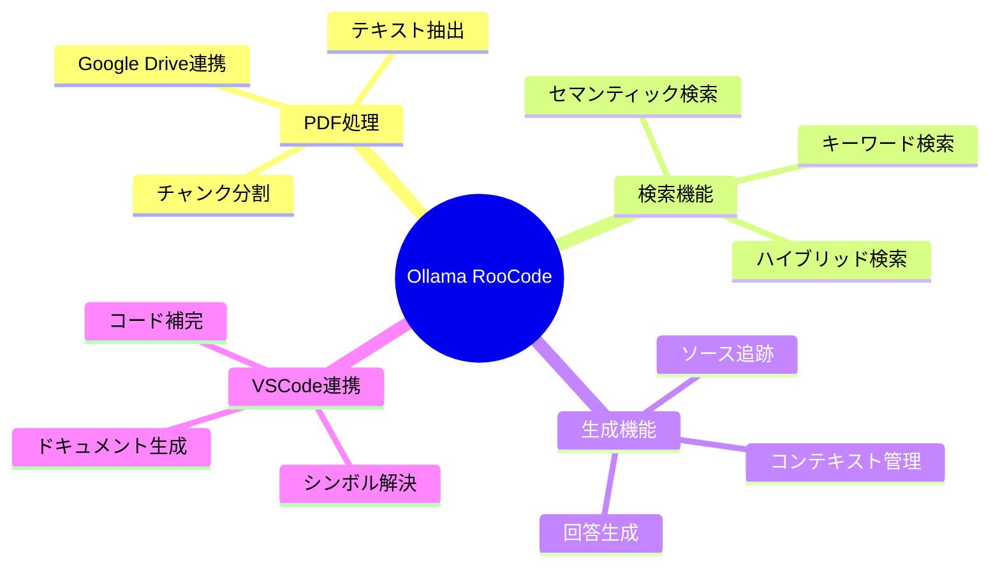
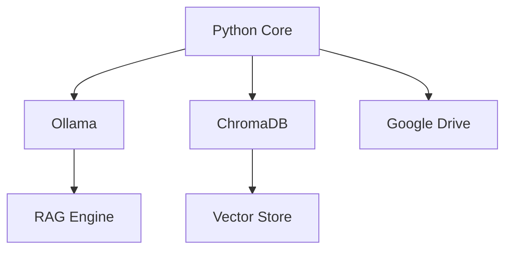
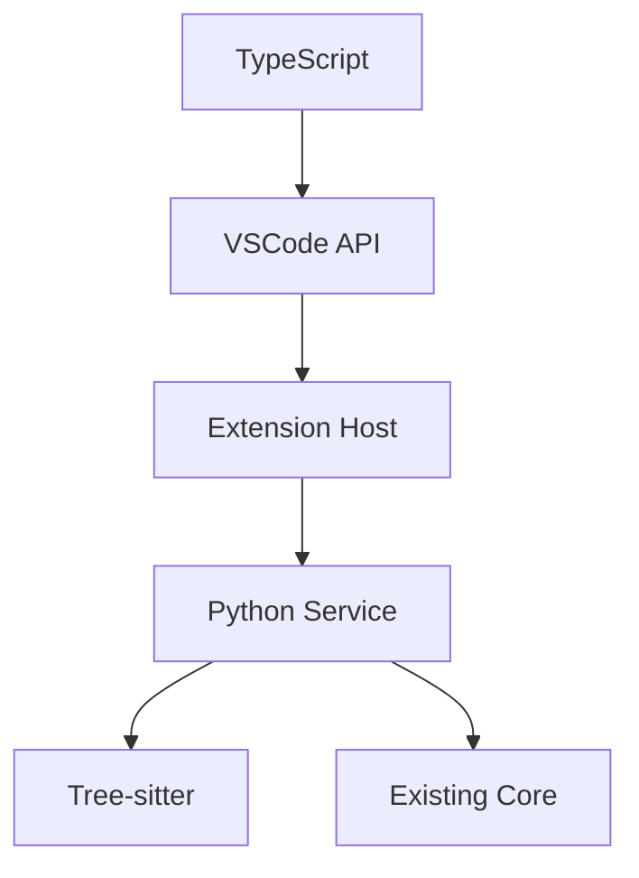
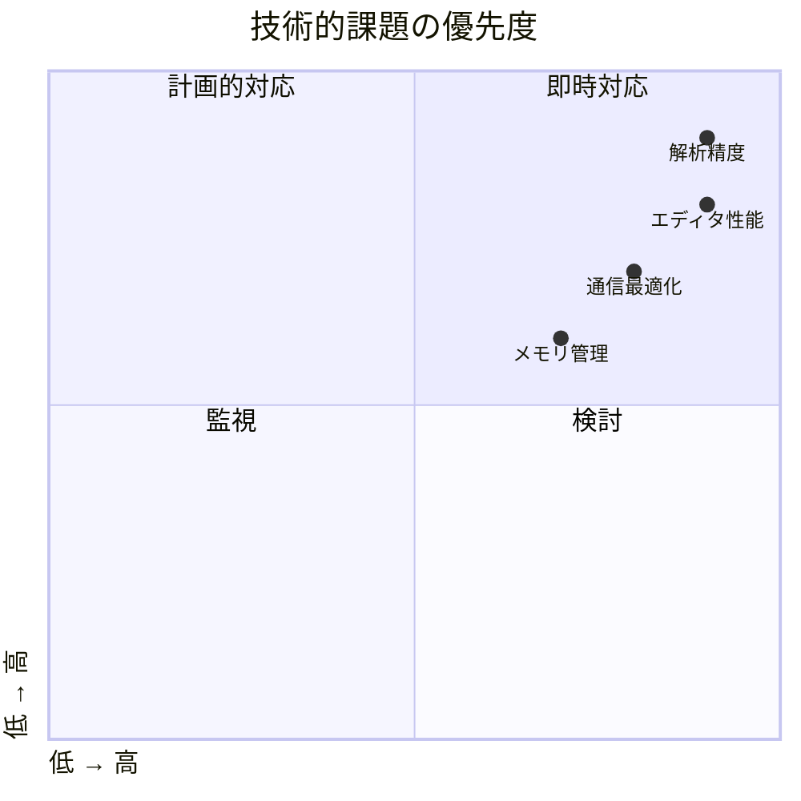

# プロジェクトロードマップ

## 1. プロジェクト概要

### 1.1 目的
開発者向けのインテリジェントなドキュメント検索・支援システムの構築

### 1.2 主要機能

## 2. フェーズ進捗

### Phase 1: 基盤環境構築 ✅
- Ollama統合
- 基本機能実装
- 設定管理

### Phase 2: データ処理システム ✅
- PDF処理
- キャッシュ管理
- 変更監視

### Phase 3: RAGシステム ✅
- ベクトルストア
- 検索エンジン
- 生成システム

### Phase 4: RooCode連携 🔄
- VSCode拡張
- コード分析
- UI/UX実装

## 3. 技術スタック

### 3.1 現状

### 3.2 Phase 4追加予定

## 4. マイルストーン

### 4.1 完了済み
| フェーズ | 成果物 | 状態 |
|---------|--------|------|
| Phase 1 | Ollama統合 | ✅ |
| Phase 1 | 基本機能 | ✅ |
| Phase 2 | PDF処理 | ✅ |
| Phase 2 | キャッシュ | ✅ |
| Phase 3 | ベクトルストア | ✅ |
| Phase 3 | 検索エンジン | ✅ |

### 4.2 進行中
| フェーズ | 成果物 | 期限 |
|---------|--------|------|
| Phase 4 | 基盤構築 | 2025/06/03 |
| Phase 4 | コア機能 | 2025/06/24 |
| Phase 4 | UI/UX | 2025/07/08 |
| Phase 4 | 最適化 | 2025/07/15 |

## 5. 課題管理

### 5.1 技術的課題

### 5.2 運用課題
1. パフォーマンス最適化
   - レイテンシ改善
   - メモリ使用量削減
   - CPU負荷管理

2. 品質管理
   - 単体テスト強化
   - 統合テスト拡充
   - E2Eテスト導入

3. デプロイメント
   - CI/CD構築
   - バージョン管理
   - 更新配布

## 6. リソース計画

### 6.1 必要なリソース
| リソース | 現状 | 目標 | 備考 |
|---------|------|------|------|
| CPU | 4コア | 8コア | 並列処理用 |
| メモリ | 8GB | 16GB | キャッシュ拡張 |
| ストレージ | 50GB | 100GB | ベクトルストア用 |
| ネットワーク | 100Mbps | 1Gbps | 大規模データ転送 |

### 6.2 開発環境
1. ローカル開発
   - VSCode + 拡張機能
   - Python 3.10+
   - Node.js 18+

2. テスト環境
   - 自動テスト
   - 負荷テスト
   - 統合テスト

## 7. 今後の展開

### 7.1 短期目標（1-2ヶ月）
1. Phase 4の完了
   - VSCode拡張の実装
   - コード分析機能
   - UI/UX最適化

2. パフォーマンス改善
   - キャッシュ最適化
   - 並列処理強化
   - メモリ管理改善

### 7.2 中期目標（3-6ヶ月）
1. 機能拡張
   - マルチモデル対応
   - 追加言語サポート
   - プラグイン機能

2. スケーラビリティ
   - 分散処理対応
   - クラウド展開
   - 負荷分散

### 7.3 長期目標（6ヶ月以降）
1. エコシステム構築
   - API公開
   - サードパーティ連携
   - マーケットプレイス

2. エンタープライズ対応
   - セキュリティ強化
   - 監査ログ
   - SLA対応

## 8. リスク管理

### 8.1 特定されたリスク
| リスク | 影響度 | 発生確率 | 対策 |
|--------|--------|----------|------|
| 性能劣化 | 高 | 中 | 継続的な監視、最適化 |
| 互換性問題 | 中 | 高 | テスト強化、フォールバック |
| リソース枯渇 | 高 | 低 | 自動スケーリング、アラート |
| API制限 | 中 | 中 | キャッシュ、バッチ処理 |

### 8.2 対策計画
1. モニタリング強化
2. 自動テスト拡充
3. フォールバック機能
4. ドキュメント整備