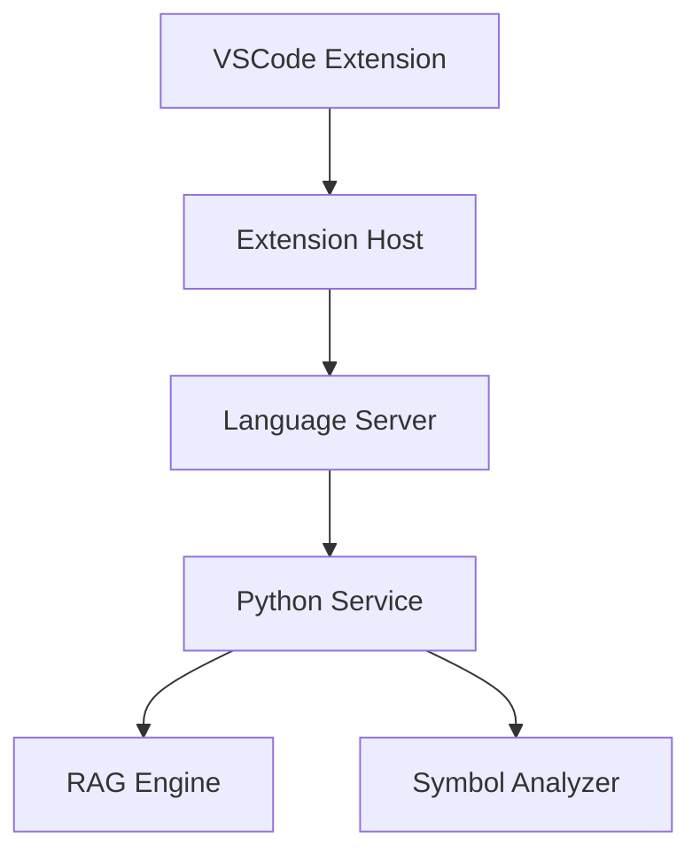
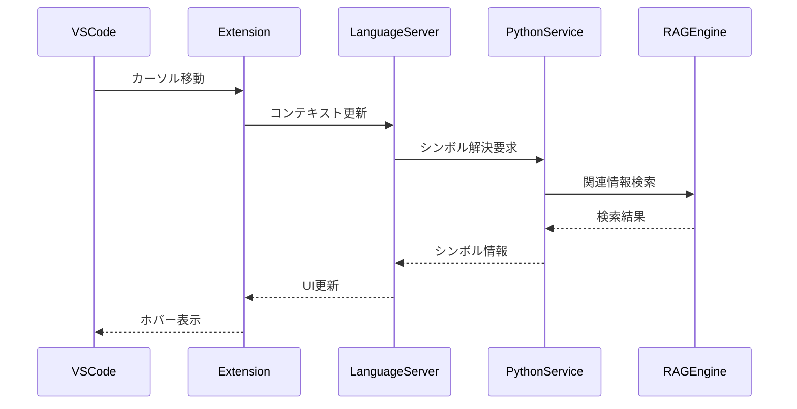
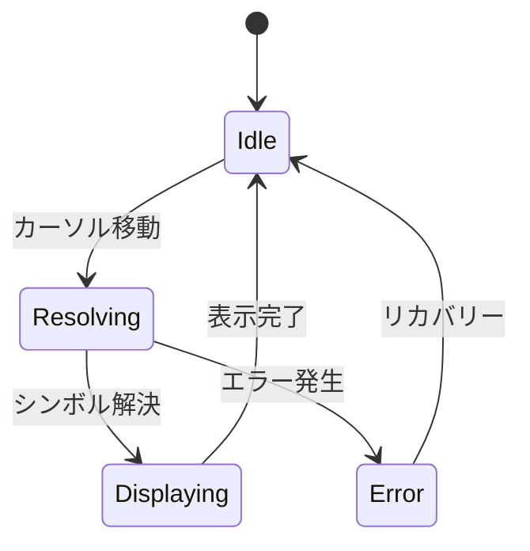

# VSCode拡張機能設計

## 1. アーキテクチャ

### 1.1 全体構造


### 1.2 コンポーネント構成
```typescript
// 拡張機能のコアモジュール
export class RooCodeExtension {
    private languageServer: LanguageServer;
    private symbolProvider: SymbolProvider;
    private documentProvider: DocumentProvider;
    private statusBar: StatusBarManager;
    private context: vscode.ExtensionContext;
}

// 言語サーバーインターフェース
interface LanguageServer {
    initialize(): Promise<void>;
    sendRequest<T>(method: string, params: any): Promise<T>;
    onNotification(method: string, handler: (params: any) => void): void;
}

// シンボル解決プロバイダー
interface SymbolProvider {
    resolveSymbol(document: TextDocument, position: Position): Promise<SymbolInfo>;
    findReferences(symbol: string): Promise<Location[]>;
    getDocumentation(symbol: string): Promise<string>;
}
```

## 2. メッセージング設計

### 2.1 プロトコル定義
```typescript
// リクエスト定義
interface Request {
    type: RequestType;
    payload: any;
    requestId: string;
    timestamp: number;
}

// レスポンス定義
interface Response {
    requestId: string;
    status: ResponseStatus;
    data?: any;
    error?: string;
    timestamp: number;
}

// メッセージタイプ
enum MessageType {
    SYMBOL_RESOLVE = 'symbol.resolve',
    DOC_GENERATE = 'doc.generate',
    CODE_COMPLETE = 'code.complete',
    CONTEXT_UPDATE = 'context.update'
}
```

### 2.2 通信フロー


## 3. UI/UXガイドライン

### 3.1 インターフェース要素
1. ステータスバー
```typescript
class StatusBarManager {
    private statusBarItem: vscode.StatusBarItem;
    
    constructor() {
        this.statusBarItem = vscode.window.createStatusBarItem(
            vscode.StatusBarAlignment.Right,
            100
        );
    }
    
    updateStatus(status: ServiceStatus): void {
        // ステータス表示の更新
    }
}
```

2. ホバー表示
```typescript
class HoverProvider implements vscode.HoverProvider {
    async provideHover(
        document: TextDocument,
        position: Position
    ): Promise<Hover> {
        // ホバー情報の提供
    }
}
```

3. コマンドパレット
```typescript
const commands = {
    'roocode.generateDocs': generateDocumentation,
    'roocode.searchSymbol': searchSymbol,
    'roocode.showReferences': showReferences
};
```

### 3.2 インタラクションフロー



## 4. 実装詳細

### 4.1 コアクラス
```typescript
// 拡張機能のエントリーポイント
export class RooCodeExtension {
    constructor(context: vscode.ExtensionContext) {
        this.context = context;
        this.initialize();
    }
    
    private async initialize(): Promise<void> {
        // 各コンポーネントの初期化
        this.languageServer = new LanguageServer();
        this.symbolProvider = new SymbolProvider(this.languageServer);
        this.documentProvider = new DocumentProvider(this.languageServer);
        this.statusBar = new StatusBarManager();
        
        // コマンドの登録
        this.registerCommands();
        
        // プロバイダーの登録
        this.registerProviders();
    }
    
    private registerCommands(): void {
        // コマンドハンドラーの登録
    }
    
    private registerProviders(): void {
        // 各種プロバイダーの登録
    }
}
```

### 4.2 設定管理
```typescript
interface RooCodeConfig {
    pythonPath: string;
    serverHost: string;
    serverPort: number;
    debugMode: boolean;
    updateDelay: number;
    maxResults: number;
}

class ConfigManager {
    static getConfig(): RooCodeConfig {
        const config = vscode.workspace.getConfiguration('roocode');
        return {
            pythonPath: config.get('pythonPath', 'python'),
            serverHost: config.get('serverHost', 'localhost'),
            serverPort: config.get('serverPort', 8000),
            debugMode: config.get('debugMode', false),
            updateDelay: config.get('updateDelay', 500),
            maxResults: config.get('maxResults', 10)
        };
    }
}
```

## 5. エラーハンドリング

### 5.1 エラー定義
```typescript
enum ErrorType {
    CONNECTION_ERROR = 'connection_error',
    TIMEOUT_ERROR = 'timeout_error',
    PARSE_ERROR = 'parse_error',
    SERVER_ERROR = 'server_error'
}

class ExtensionError extends Error {
    constructor(
        public type: ErrorType,
        message: string,
        public details?: any
    ) {
        super(message);
    }
}
```

### 5.2 エラー処理フロー
```typescript
async function handleError(error: ExtensionError): Promise<void> {
    // エラーログ記録
    logger.error(error);
    
    // ユーザー通知
    if (error.type === ErrorType.CONNECTION_ERROR) {
        vscode.window.showErrorMessage(
            'Failed to connect to RooCode service'
        );
    }
    
    // リカバリー処理
    await attemptRecovery(error);
}
```

## 6. パフォーマンス最適化

### 6.1 キャッシュ戦略
```typescript
class SymbolCache {
    private cache: Map<string, CacheEntry>;
    private readonly maxSize: number = 1000;
    
    addToCache(key: string, value: any): void {
        // LRUキャッシュの実装
    }
    
    getFromCache(key: string): any | undefined {
        // キャッシュからの取得
    }
}
```

### 6.2 デバウンス処理
```typescript
function debounce<T>(
    func: (...args: any[]) => Promise<T>,
    wait: number
): (...args: any[]) => Promise<T> {
    let timeout: NodeJS.Timeout;
    
    return (...args: any[]) => {
        return new Promise((resolve, reject) => {
            clearTimeout(timeout);
            timeout = setTimeout(
                () => func(...args).then(resolve).catch(reject),
                wait
            );
        });
    };
}
```

## 7. テスト戦略

### 7.1 単体テスト
```typescript
describe('RooCodeExtension', () => {
    let extension: RooCodeExtension;
    
    beforeEach(() => {
        // テスト環境のセットアップ
    });
    
    test('initialize', async () => {
        // 初期化のテスト
    });
    
    test('symbol resolution', async () => {
        // シンボル解決のテスト
    });
});
```

### 7.2 統合テスト
```typescript
describe('Extension Integration', () => {
    test('end-to-end workflow', async () => {
        // E2Eテストの実装
    });
});
```

## 8. デプロイメント

### 8.1 パッケージング
```json
{
    "name": "roocode",
    "displayName": "RooCode",
    "version": "0.1.0",
    "engines": {
        "vscode": "^1.60.0"
    },
    "activationEvents": [
        "onLanguage:python",
        "onLanguage:typescript",
        "onLanguage:javascript"
    ],
    "contributes": {
        "commands": [
            {
                "command": "roocode.generateDocs",
                "title": "RooCode: Generate Documentation"
            }
        ]
    }
}
```

### 8.2 配布プロセス
1. ビルド
2. パッケージング
3. マーケットプレイス公開
4. 自動更新設定