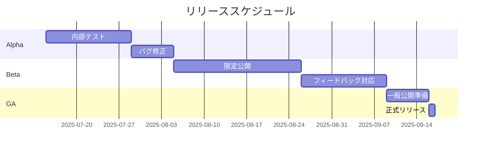
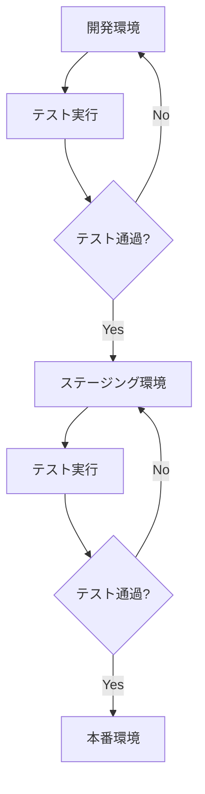
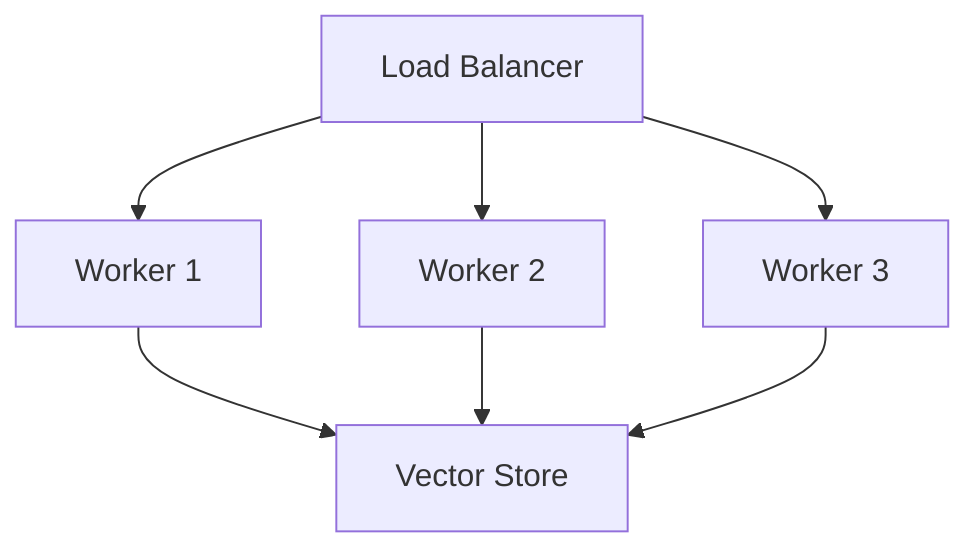
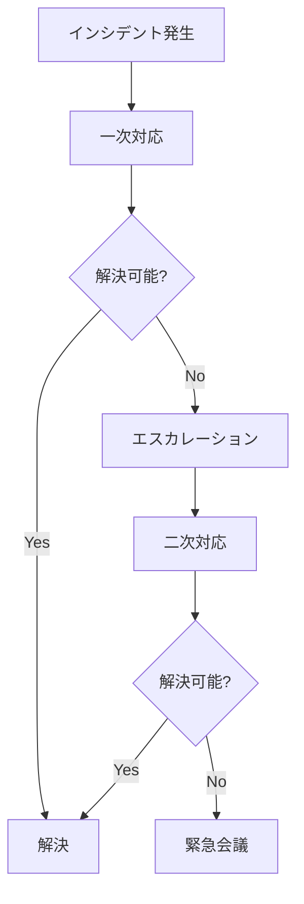

# リリースと運用ガイド

## 1. リリース計画

### 1.1 リリースフェーズ


### 1.2 リリースチェックリスト

#### 機能確認
- [ ] RAGエンジンの動作確認
- [ ] VSCode拡張の動作確認
- [ ] エラーハンドリングの確認
- [ ] パフォーマンステスト

#### 品質確認
- [ ] 単体テストの実行
- [ ] 統合テストの実行
- [ ] E2Eテストの実行
- [ ] セキュリティチェック

#### ドキュメント
- [ ] APIドキュメント
- [ ] ユーザーガイド
- [ ] 運用マニュアル
- [ ] リリースノート

## 2. デプロイメント手順

### 2.1 環境準備
```bash
# 1. 環境変数の設定
cat > .env << EOF
DEBUG=false
LOG_LEVEL=info
CACHE_TTL=3600
MAX_CONNECTIONS=100
EOF

# 2. 依存関係のインストール
pip install -r requirements.txt

# 3. データベース初期化
python scripts/init_db.py
```

### 2.2 デプロイメントフロー


## 3. 監視と運用

### 3.1 監視項目

#### システムメトリクス
| メトリクス | 閾値 | アラート |
|-----------|------|---------|
| CPU使用率 | 80% | 警告 |
| メモリ使用率 | 85% | 警告 |
| ディスク使用率 | 90% | 緊急 |
| レイテンシ | 1000ms | 警告 |

#### アプリケーションメトリクス
| メトリクス | 目標値 | 監視間隔 |
|-----------|--------|---------|
| 検索応答時間 | <200ms | 1分 |
| 生成応答時間 | <1000ms | 1分 |
| エラー率 | <1% | 5分 |
| キャッシュヒット率 | >80% | 5分 |

### 3.2 アラート設定
```yaml
alerts:
  high_cpu:
    condition: cpu_usage > 80%
    duration: 5m
    severity: warning
    
  high_memory:
    condition: memory_usage > 85%
    duration: 5m
    severity: warning
    
  high_latency:
    condition: response_time > 1000ms
    duration: 1m
    severity: critical
```

## 4. バックアップと復旧

### 4.1 バックアップ戦略
1. ベクトルストア
   - 毎日の完全バックアップ
   - 6時間ごとの増分バックアップ
   
2. キャッシュデータ
   - 12時間ごとのスナップショット
   
3. 設定データ
   - 変更時のバージョン管理

### 4.2 復旧手順
```bash
# 1. サービスの停止
systemctl stop roocode

# 2. バックアップからの復元
python scripts/restore.py --backup-date YYYY-MM-DD

# 3. 整合性チェック
python scripts/verify_data.py

# 4. サービスの再開
systemctl start roocode
```

## 5. スケーリング計画

### 5.1 垂直スケーリング
```yaml
resource_limits:
  small:
    cpu: 2
    memory: 4Gi
  medium:
    cpu: 4
    memory: 8Gi
  large:
    cpu: 8
    memory: 16Gi
```

### 5.2 水平スケーリング


## 6. インシデント対応

### 6.1 インシデントレベル
| レベル | 説明 | 対応時間 |
|-------|------|---------|
| P1 | システム停止 | 即時 |
| P2 | 重大な機能障害 | 2時間以内 |
| P3 | 軽微な機能障害 | 24時間以内 |
| P4 | 改善要望 | 1週間以内 |

### 6.2 エスカレーションフロー


## 7. パフォーマンスチューニング

### 7.1 キャッシュ最適化
```python
CACHE_CONFIG = {
    'vector_cache_size': 10000,
    'result_cache_ttl': 7200,
    'batch_size': 200
}

INDEX_CONFIG = {
    'n_trees': 150,
    'search_k': 150,
    'metric': 'cosine'
}
```

### 7.2 データベース最適化
```sql
-- インデックスの作成
CREATE INDEX idx_embeddings ON vectors USING ivfflat (embedding vector_cosine_ops)
    WITH (lists = 100);

-- パーティショニング
CREATE TABLE vectors_partitioned (
    LIKE vectors INCLUDING ALL
) PARTITION BY RANGE (created_at);
```

## 8. セキュリティ対策

### 8.1 認証・認可
```yaml
security:
  auth:
    type: OAuth2
    provider: GitHub
    scopes:
      - read:user
      - repo
  
  rate_limit:
    requests_per_minute: 60
    burst: 10
```

### 8.2 データ保護
- 保存データの暗号化
- 通信の暗号化
- アクセスログの監査

## 9. ドキュメント管理

### 9.1 ドキュメント構成
```
docs/
├── api/
│   ├── reference.md
│   └── examples.md
├── user/
│   ├── getting-started.md
│   └── advanced.md
└── ops/
    ├── deployment.md
    └── maintenance.md
```

### 9.2 バージョン管理
- セマンティックバージョニングの採用
- CHANGELOGの維持
- ドキュメントのバージョン管理