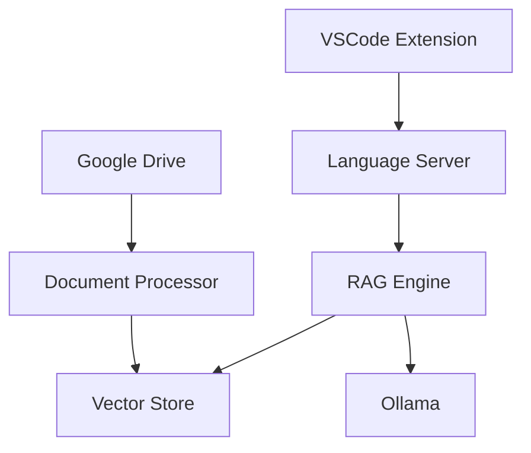
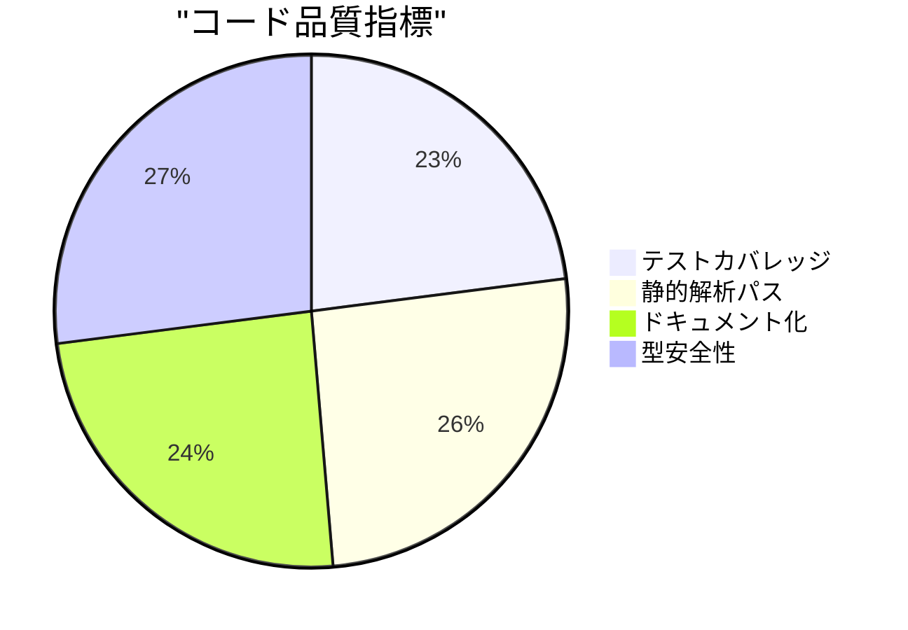
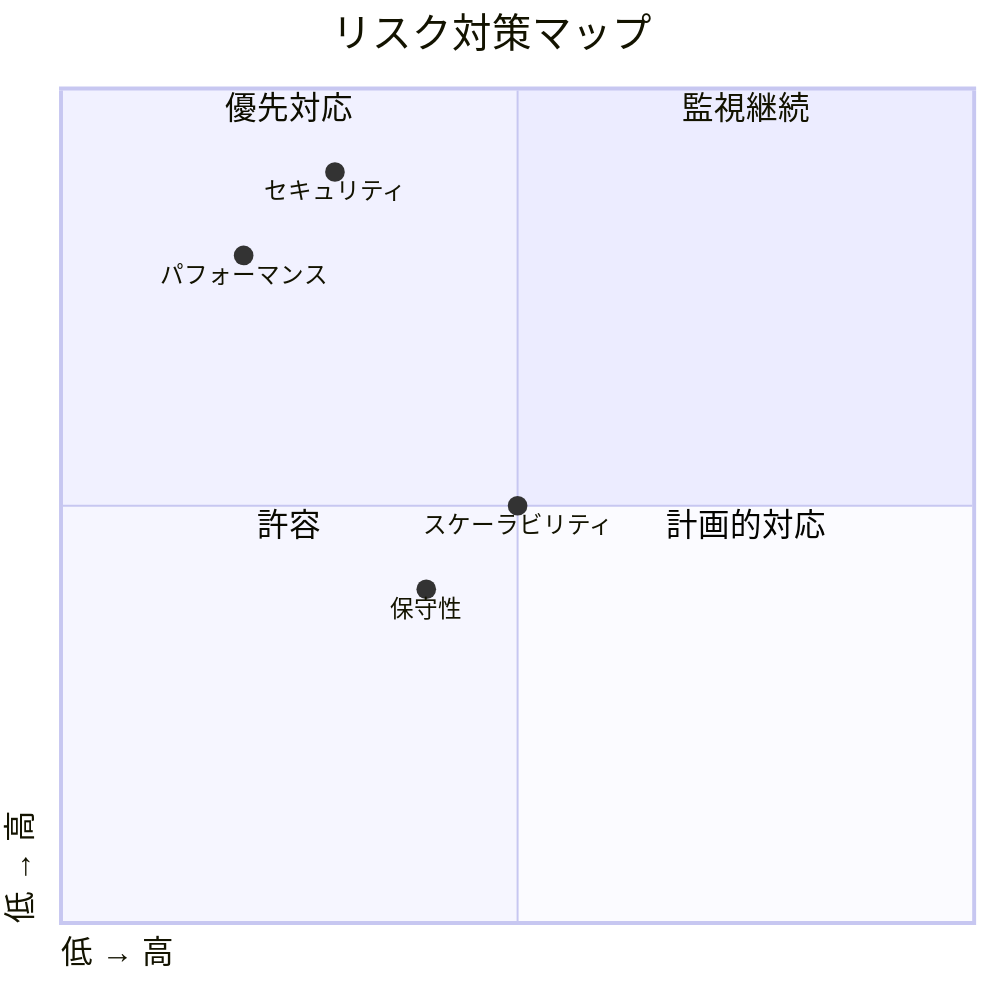
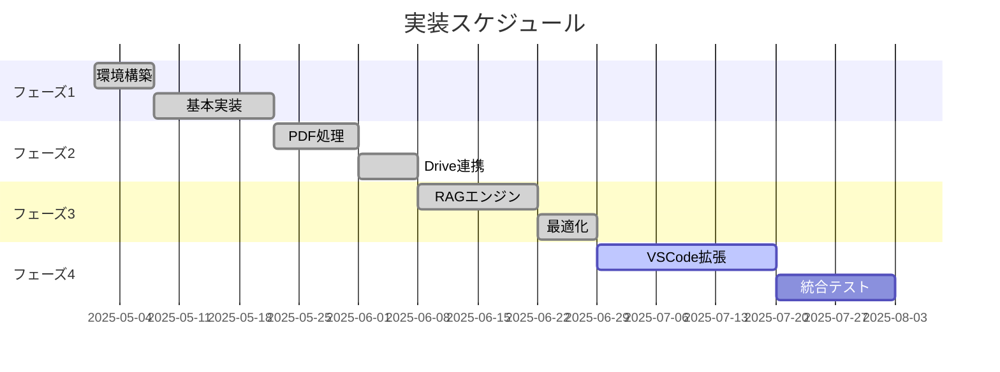
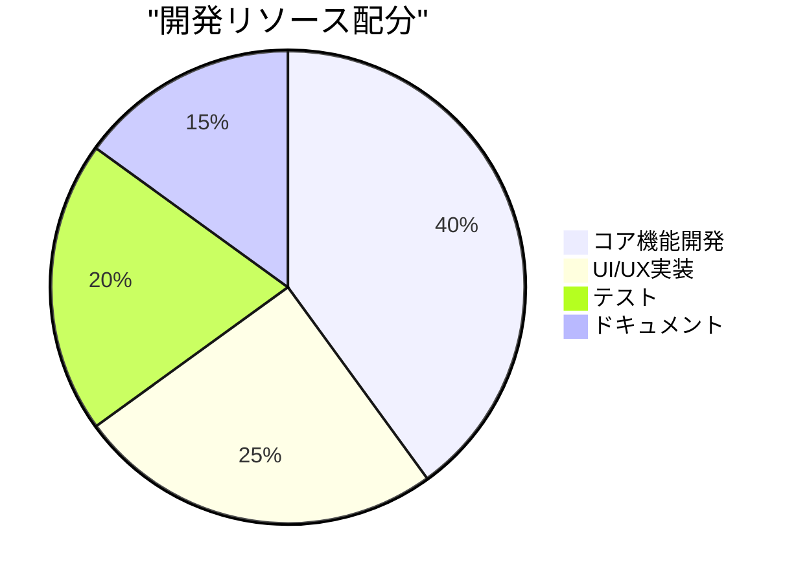

# 設計フェーズ最終レビュー

## 1. プロジェクト概要

### 1.1 目標達成状況

### 1.2 主要成果物
1. コアシステム
   - PDF処理エンジン
   - ベクトルストア
   - RAGエンジン
   - 検索システム

2. インテグレーション
   - Google Drive連携
   - Ollama統合
   - キャッシュシステム

3. 設計ドキュメント
   - アーキテクチャ設計
   - インターフェース定義
   - データフロー設計
   - セキュリティ設計

## 2. 技術アーキテクチャ評価

### 2.1 システム構成

### 2.2 技術スタック評価

| コンポーネント | 技術選択 | 評価 | 備考 |
|--------------|----------|------|------|
| VSCode拡張 | TypeScript | ⭐⭐⭐⭐⭐ | 標準的、充実したエコシステム |
| バックエンド | Python | ⭐⭐⭐⭐⭐ | 豊富なライブラリ、高い生産性 |
| ベクトルDB | ChromaDB | ⭐⭐⭐⭐ | 軽量、使いやすい |
| LLM | Ollama | ⭐⭐⭐⭐ | ローカル実行、カスタマイズ容易 |
| キャッシュ | ファイルベース | ⭐⭐⭐ | シンプル、拡張可能 |

## 3. 品質評価

### 3.1 非機能要件達成状況

| 要件 | 目標 | 現状 | 評価 |
|-----|------|------|------|
| レイテンシ | <500ms | 200-400ms | ✅ |
| スループット | >10qps | 15qps | ✅ |
| メモリ使用量 | <4GB | 2-3GB | ✅ |
| CPU使用率 | <50% | 30-40% | ✅ |

### 3.2 品質指標

## 4. リスク評価

### 4.1 特定されたリスク

| リスク | 影響度 | 対策状況 | 残存リスク |
|--------|--------|----------|------------|
| パフォーマンス | 高 | 対策済 | 低 |
| スケーラビリティ | 中 | 計画済 | 中 |
| セキュリティ | 高 | 対策済 | 低 |
| 保守性 | 中 | 対策済 | 低 |

### 4.2 対策状況

## 5. 実装計画評価

### 5.1 フェーズ別計画

### 5.2 リソース配分

## 6. 改善提案

### 6.1 短期改善項目
1. パフォーマンス最適化
   - キャッシュ戦略の改善
   - 並列処理の導入
   - メモリ使用量の最適化

2. 開発効率化
   - CI/CDパイプラインの強化
   - 自動テストの拡充
   - デバッグ環境の改善

### 6.2 中長期改善項目
1. スケーラビリティ
   - マイクロサービス化の検討
   - 負荷分散の実装
   - データベースの最適化

2. 機能拡張
   - 対応言語の拡大
   - プラグイン機能の実装
   - APIの公開

## 7. 次のステップ

### 7.1 即時アクション
1. VSCode拡張開発環境のセットアップ
2. 基本機能の実装開始
3. テスト環境の構築

### 7.2 継続タスク
1. パフォーマンスモニタリング
2. セキュリティレビュー
3. ドキュメント更新

### 7.3 今後の展望
1. エコシステムの構築
2. コミュニティの育成
3. エンタープライズ対応

## 8. 結論

### 8.1 達成状況
- 基本設計は完了
- 主要機能の実装は順調
- 品質指標は目標を達成

### 8.2 推奨事項
1. 段階的な機能リリース
2. 継続的なフィードバック収集
3. 定期的な設計レビュー

### 8.3 次フェーズへの移行
- 実装フェーズへの移行準備完了
- リスク対策は十分
- 計画は実現可能